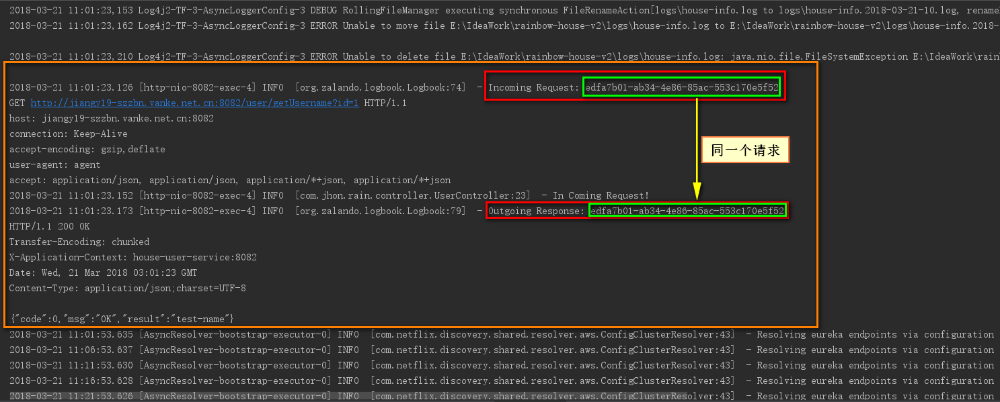

# 房产销售平台--微服务化
> 　　去年的时候新建过一个业余项目[microservice-rainbow](https://github.com/YuJhon/microservice-rainbow)来学习Spring cloud的一些基础组件的使用，但是没有在实际项目中应用过，有些东西还是停留在了理论阶段，现在正好有一个业余的项目来实战操作，以此来加强对SpringCloud微服务架构的了解和应用。
## 项目初始化预览
* 1.注册中心搭建完成


* 2.Eureka-Server项目结构


* 3.Eureka-Server项目配置文件


* 4.Eureka-Client项目结构


* 5.Eureka-Client项目配置文件


* 6.Api-Gateway项目结构


* 7.Api-Gateway项目配置文件


* 更新日期：2018-03-20

## 服务通信组件RestTemplate + httpclient的二次封装
* 添加基础依赖
```xml
<dependency>
    <groupId>org.projectlombok</groupId>
    <artifactId>lombok</artifactId>
</dependency>
<dependency>
    <groupId>com.alibaba</groupId>
    <artifactId>fastjson</artifactId>
    <version>1.2.31</version>
</dependency>
<dependency>
    <groupId>org.apache.httpcomponents</groupId>
    <artifactId>httpclient</artifactId>
</dependency>
```

* HttpClient属性的设置(通过配置文件来定义)
```java
package com.jhon.rain.config;

import org.springframework.boot.context.properties.ConfigurationProperties;

/**
 * <p>功能描述</br>Httpclient的属性配置</p>
 *
 * @author jiangy19
 * @version v1.0
 * @projectName rainbow-house-v2
 * @date 2018/3/20 21:17
 */
@ConfigurationProperties(prefix = "spring.httpclient")
public class HttpClientProperties {

  private Integer connectTimeOut = 1000;

  private Integer socketTimeOut = 1000000;

  private String agent = "agent";

  private Integer maxConnPerRoute = 10;

  private Integer maxConnTotal = 50;


  public Integer getConnectTimeOut() {
    return connectTimeOut;
  }

  public void setConnectTimeOut(Integer connectTimeOut) {
    this.connectTimeOut = connectTimeOut;
  }

  public Integer getSocketTimeOut() {
    return socketTimeOut;
  }

  public void setSocketTimeOut(Integer socketTimeOut) {
    this.socketTimeOut = socketTimeOut;
  }

  public String getAgent() {
    return agent;
  }

  public void setAgent(String agent) {
    this.agent = agent;
  }

  public Integer getMaxConnPerRoute() {
    return maxConnPerRoute;
  }

  public void setMaxConnPerRoute(Integer maxConnPerRoute) {
    this.maxConnPerRoute = maxConnPerRoute;
  }

  public Integer getMaxConnTotal() {
    return maxConnTotal;
  }

  public void setMaxConnTotal(Integer maxConnTotal) {
    this.maxConnTotal = maxConnTotal;
  }
}

```

* HttpClient的重新封装
```java
package com.jhon.rain.config;

import org.apache.http.client.HttpClient;
import org.apache.http.client.config.RequestConfig;
import org.apache.http.impl.client.HttpClientBuilder;
import org.springframework.beans.factory.annotation.Autowired;
import org.springframework.boot.autoconfigure.condition.ConditionalOnClass;
import org.springframework.boot.autoconfigure.condition.ConditionalOnMissingBean;
import org.springframework.boot.context.properties.EnableConfigurationProperties;
import org.springframework.context.annotation.Bean;
import org.springframework.context.annotation.Configuration;
import org.zalando.logbook.httpclient.LogbookHttpRequestInterceptor;
import org.zalando.logbook.httpclient.LogbookHttpResponseInterceptor;

/**
 * <p>功能描述</br>自动配置类</p>
 *
 * @author jiangy19
 * @version v1.0
 * @projectName rainbow-house-v2
 * @date 2018/3/20 21:24
 */
@Configuration
@ConditionalOnClass({HttpClient.class})
@EnableConfigurationProperties(HttpClientProperties.class)
public class HttpClientAutoConfiguration {

  private final HttpClientProperties properties;

  public HttpClientAutoConfiguration(HttpClientProperties properties) {
    this.properties = properties;
  }

  @Autowired
  private LogbookHttpRequestInterceptor logbookHttpRequestInterceptor;

  @Autowired
  private LogbookHttpResponseInterceptor logbookHttpResponseInterceptor;

  /**
   * <pre>重新定义HttpClient(httpclient bean 的定义)</pre>
   *
   * @return
   */
  @Bean
  @ConditionalOnMissingBean(HttpClient.class)
  public HttpClient httpClient() {
    /** 构建requestConfig **/
    RequestConfig requestConfig = RequestConfig.custom()
            .setConnectionRequestTimeout(properties.getConnectTimeOut())
            .setSocketTimeout(properties.getSocketTimeOut()).build();

    HttpClient client = HttpClientBuilder.create().setDefaultRequestConfig(requestConfig)
            .setUserAgent(properties.getAgent())
            .setMaxConnPerRoute(properties.getMaxConnPerRoute())
            .setMaxConnTotal(properties.getMaxConnTotal())
            .addInterceptorFirst(logbookHttpRequestInterceptor)
            .addInterceptorFirst(logbookHttpResponseInterceptor)
            .build();

    return client;
  }
}

```

* Rest调用封装[既支持直连又支持服务发现的调用]
```java
package com.jhon.rain.config;

import org.springframework.beans.factory.annotation.Autowired;
import org.springframework.core.ParameterizedTypeReference;
import org.springframework.http.HttpEntity;
import org.springframework.http.HttpMethod;
import org.springframework.http.ResponseEntity;
import org.springframework.stereotype.Component;
import org.springframework.web.client.RestTemplate;

/**
 * <p>功能描述</br>Rest调用封装[既支持直连又支持服务发现的调用]</p>
 *
 * @author jiangy19
 * @version v1.0
 * @projectName rainbow-house-v2
 * @date 2018/3/20 21:49
 */
@Component
public class GenericRest {

  @Autowired
  private RestTemplate lbRestTemplate;

  @Autowired
  private RestTemplate directRestTemplate;

  private static final String DIRECT_FLAG = "direct://";

  /**
   * <pre>Post请求方式</pre>
   *
   * @param url
   * @param reqBody
   * @param responseType
   * @param <T>
   * @return
   */
  public <T> ResponseEntity<T> post(String url, Object reqBody, ParameterizedTypeReference<T> responseType) {
    RestTemplate template = getRestTemplate(url);
    url = url.replace(DIRECT_FLAG, "");
    return template.exchange(url, HttpMethod.POST, new HttpEntity(reqBody), responseType);
  }

  /**
   * <pre>Get请求方式</pre>
   *
   * @param url
   * @param responseType
   * @param <T>
   * @return
   */
  public <T> ResponseEntity<T> get(String url, ParameterizedTypeReference<T> responseType) {
    RestTemplate template = getRestTemplate(url);
    url = url.replace(DIRECT_FLAG, "");
    return template.exchange(url, HttpMethod.GET, HttpEntity.EMPTY, responseType);
  }

  /**
   * <pre>获取resttemplate</pre>
   *
   * @param url
   * @return
   */
  private RestTemplate getRestTemplate(String url) {
    if (url.contains(DIRECT_FLAG)) {
      return directRestTemplate;
    } else {
      return lbRestTemplate;
    }
  }
}

```
## Logbook的引入和http日志输出
* 添加Maven依赖([Logbook介绍](https://github.com/zalando/logbook))
```xml
<dependency>
    <groupId>org.zalando</groupId>
    <artifactId>logbook-core</artifactId>
    <version>${logbook.version}</version>
</dependency>
<dependency>
    <groupId>org.zalando</groupId>
    <artifactId>logbook-servlet</artifactId>
    <version>${logbook.version}</version>
</dependency>
<dependency>
    <groupId>org.zalando</groupId>
    <artifactId>logbook-httpclient</artifactId>
    <version>${logbook.version}</version>
</dependency>
<dependency>
    <groupId>org.zalando</groupId>
    <artifactId>logbook-spring-boot-starter</artifactId>
    <version>${logbook.version}</version>
</dependency>

<dependency> <!-- exclude掉spring-boot的默认log配置 -->
    <groupId>org.springframework.boot</groupId>
    <artifactId>spring-boot-starter</artifactId>
    <exclusions>
        <exclusion>
            <groupId>org.springframework.boot</groupId>
            <artifactId>spring-boot-starter-logging</artifactId>
        </exclusion>
    </exclusions>
</dependency>

<dependency>
    <groupId>org.springframework.boot</groupId>
    <artifactId>spring-boot-starter-log4j2</artifactId>
</dependency>
<!--开启log4j2的异步日志必须要依赖的分布式高性能框架-->
<dependency>
    <groupId>com.lmax</groupId>
    <artifactId>disruptor</artifactId>
    <version>3.3.6</version>
</dependency>
```
* HttpClient Bean的封装和Logbook请求和响应拦截器的配置


* Logbook配置日志的级别和日志的格式


    ```properties
    logging.config=classpath:log4j2.xml
    logbook.write.level=INFO
    logbook.format.style=http
    ```
    
* RestTemplate Bean的封装[加入消息转换器]
```java
package com.jhon.rain.config;

import com.alibaba.fastjson.support.spring.FastJsonHttpMessageConverter4;
import org.apache.http.client.HttpClient;
import org.springframework.cloud.client.loadbalancer.LoadBalanced;
import org.springframework.context.annotation.Bean;
import org.springframework.context.annotation.Configuration;
import org.springframework.http.MediaType;
import org.springframework.http.client.HttpComponentsClientHttpRequestFactory;
import org.springframework.http.converter.StringHttpMessageConverter;
import org.springframework.web.client.RestTemplate;

import java.nio.charset.Charset;
import java.util.Arrays;

/**
 * <p>功能描述</br>RestTemplate Bean的封装[加入消息转换器]</p>
 *
 * @author jiangy19
 * @version v1.0
 * @projectName rainbow-house-v2
 * @date 2018/3/20 21:40
 */
@Configuration
public class RestAutoConfig {

  public static class RestTemplateConfig {

    @Bean
    @LoadBalanced
    RestTemplate lbRestTemplate(HttpClient httpClient) {
      RestTemplate template = new RestTemplate(new HttpComponentsClientHttpRequestFactory(httpClient));
      template.getMessageConverters().add(0, new StringHttpMessageConverter(Charset.forName("utf-8")));
      template.getMessageConverters().add(1, new FastJsonHttpMessageConvert5());
      return template;
    }

    @Bean
    RestTemplate directRestTemplate(HttpClient httpclient) {
      RestTemplate template = new RestTemplate(new HttpComponentsClientHttpRequestFactory(httpclient));
      template.getMessageConverters().add(0, new StringHttpMessageConverter(Charset.forName("utf-8")));
      template.getMessageConverters().add(1, new FastJsonHttpMessageConvert5());
      return template;
    }

    public static class FastJsonHttpMessageConvert5 extends FastJsonHttpMessageConverter4 {

      static final Charset DEFAULT_CHARSET = Charset.forName("UTF-8");

      public FastJsonHttpMessageConvert5() {
        setDefaultCharset(DEFAULT_CHARSET);
        setSupportedMediaTypes(Arrays.asList(MediaType.APPLICATION_JSON, new MediaType("application", "*+json")));
      }

    }
  }
}
```

* 服务网关(House-API-Gateway)
    * [1].UserAPIController.java
    ```java
    package com.jhon.rain.api.controller;
    
    import com.jhon.rain.api.service.UserService;
    import lombok.extern.slf4j.Slf4j;
    import org.springframework.beans.factory.annotation.Autowired;
    import org.springframework.web.bind.annotation.*;
    
    /**
     * <p>功能描述</br></p>
     *
     * @author jiangy19
     * @version v1.0
     * @projectName rainbow-house-v2
     * @date 2018/3/20 22:47
     */
    @RestController
    @RequestMapping("api/user")
    @Slf4j
    public class UserAPIController {
    
      @Autowired
      private UserService userService;
    
      @GetMapping("getUsername/{id}")
      public String getUsername(@PathVariable(name = "id") Long id) {
        log.info("API-Gateway Controller Request Comming!");
        return userService.getUsername(id);
      }
    }
    
    ```
    * [2].UserService.java
    ```java
    package com.jhon.rain.api.service;
    
    import com.jhon.rain.api.dao.UserDao;
    import com.netflix.discovery.converters.Auto;
    import lombok.extern.slf4j.Slf4j;
    import org.springframework.beans.factory.annotation.Autowired;
    import org.springframework.stereotype.Service;
    
    /**
     * <p>功能描述</br></p>
     *
     * @author jiangy19
     * @version v1.0
     * @projectName rainbow-house-v2
     * @date 2018/3/20 22:47
     */
    @Service
    @Slf4j
    public class UserService {
    
      @Autowired
      private UserDao userDao;
    
      /**
       * <pre>获取用户名</pre>
       *
       * @param id 用户id
       * @return
       */
      public String getUsername(Long id) {
        return userDao.getUserNameById(id);
      }
    }
    ```
    * [3].UserDao.java
    ```java
    package com.jhon.rain.api.dao;
    
    import com.jhon.rain.api.common.RestResponse;
    import com.jhon.rain.api.config.GenericRest;
    import org.springframework.beans.factory.annotation.Autowired;
    import org.springframework.beans.factory.annotation.Value;
    import org.springframework.core.ParameterizedTypeReference;
    import org.springframework.stereotype.Repository;
    
    /**
     * <p>功能描述</br></p>
     *
     * @author jiangy19
     * @version v1.0
     * @projectName rainbow-house-v2
     * @date 2018/3/20 22:38
     */
    @Repository
    public class UserDao {
    
      @Autowired
      private GenericRest rest;
    
      @Value("${user.service.name}")
      private String userServiceName;
    
      /**
       * <pre>调用服务</pre>
       *
       * @param id 用户id
       * @return 返回用户名
       */
      public String getUserNameById(Long id) {
        String url = "http://" + userServiceName + "/user/getUsername?id=" + id;
        RestResponse<String> restResponse = rest.get(url, new ParameterizedTypeReference<RestResponse<String>>() {
        }).getBody();
        if (restResponse.getCode() == 0) {
          return restResponse.getResult();
        } else {
          return null;
        }
      }
    }
    ```
    
* 用户服务提供接口(House-User-Service)
    * UserController.java
    ```java
    package com.jhon.rain.controller;
    
    import com.jhon.rain.user.common.RestResponse;
    import lombok.extern.slf4j.Slf4j;
    import org.springframework.web.bind.annotation.RequestMapping;
    import org.springframework.web.bind.annotation.RestController;
    
    /**
     * <p>功能描述</br></p>
     *
     * @author jiangy19
     * @version v1.0
     * @projectName rainbow-house-v2
     * @date 2018/3/20 22:27
     */
    @RestController
    @Slf4j
    @RequestMapping("user")
    public class UserController {
    
      @RequestMapping("getUsername")
      public RestResponse<String> getUserName(Long id) {
        log.info("In Coming Request!");
        return RestResponse.success("test-name");
      }
    }
    ```
    
* 结果展示
    * 整合Logbook日志框架后的API-Gateway项目HTTP调用(Rest工具)
    
    * House-User-Service提供的日志记录
    
    * House-API-Gateway提供的日志记录
    
    
    * 整合Logbook日志框架后的API-Gateway项目Curl工具调用
    
    * House-API-Gateway提供的日志记录
    
        
* 更新日期：2018-03-21 12:00:00

## [Spring Cloud Ribbon]负载均衡组件引入
* Maven依赖(House-API-Gateway)
    * 【注意】由于Spring-Cloud-Starter-Eureka-Server中已经默认将Ribbon的依赖引入了，所以我们在项目中不需要再次单独将Ribbon的依赖添加到pom文件中。
    * Starter-Eureka-Server中默认添加了Ribbon的依赖，如下图所示：
        
        
* RestTemplate添加@LoadBalanced注解

    
* 模拟请求（每次id不同）


* 请求结果展示
    * House-User-Service 8090实例Console日志
    8090实例的Console日志.png)
    * House-User-Service 8091实例console日志
    8091实例的Console日志.png)
    
* 如果想使用Ribbon而不依赖于Eureka，则参考一下文档:
    [spring-cloud-ribbon-without-eureka](http://projects.spring.io/spring-cloud/spring-cloud.html#spring-cloud-ribbon-without-eureka)
    
    